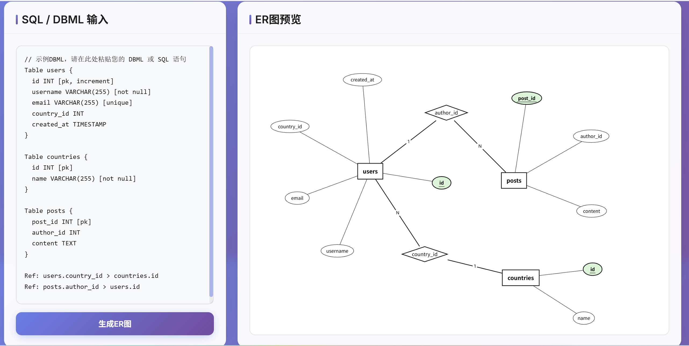
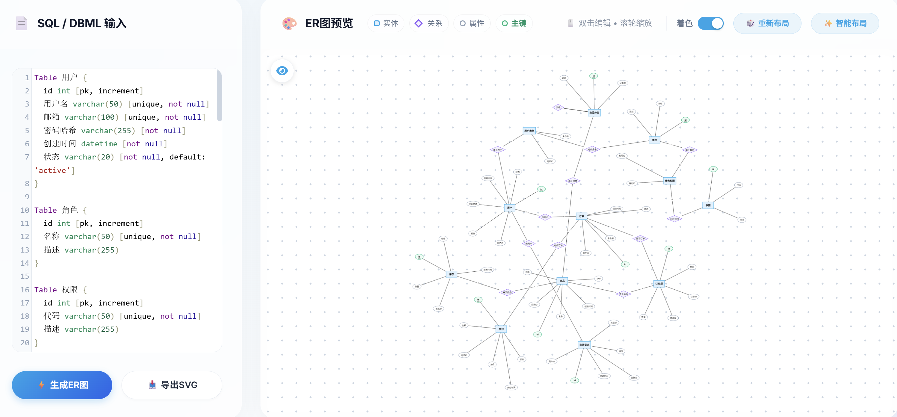
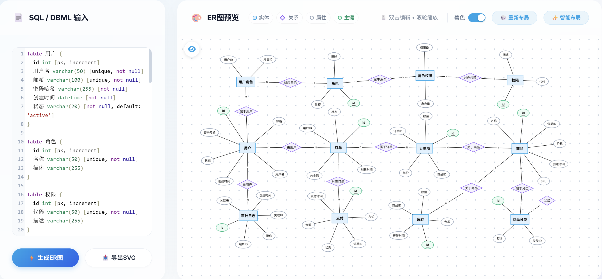

[**English**](README.en.md) | [简体中文](README.md)

## Quick Start

Visit: [ER Diagram Generator](https://ystemsrx.github.io/ER_diagram_generator/sql2er.html)

If you need to draw a logical model, please use [dbdiagram.io](https://dbdiagram.io), which is free.

# SQL/DBML to ER Diagram Generator

A web-based tool for generating Chen model ER diagrams from SQL CREATE TABLE statements and DBML format.

## Usage

1. Open `sql2er.html` in your web browser
2. Paste your SQL CREATE TABLE statements or DBML code in the input area
3. Click "Generate ER Diagram" button
4. If you're not satisfied with the node positions, you can drag nodes to adjust the layout; double-click a node to edit its content
5. If the diagram is complex, simply drag each rectangle (entity) to the desired position and click the "Smart Optimization" button to automatically organize the layout

## Supported Formats

### SQL Example
```sql
CREATE TABLE users (
    id INT PRIMARY KEY,
    username VARCHAR(255) NOT NULL,
    email VARCHAR(255) UNIQUE
);

CREATE TABLE posts (
    id INT PRIMARY KEY,
    author_id INT,
    title VARCHAR(255),
    FOREIGN KEY (author_id) REFERENCES users(id)
);
```

### DBML Example
```dbml
Table users {
  id INT [pk]
  username VARCHAR(255) [not null]
  email VARCHAR(255) [unique]
}

Table posts {
  id INT [pk]
  author_id INT
  title VARCHAR(255)
}

Ref: posts.author_id > users.id
```

## Chen Model Elements

- **Rectangle**: Entity (Table)
- **Diamond**: Relationship (Foreign Key)
- **Ellipse**: Attribute (Column)
- **Underlined**: Primary Key attribute

## Example



When the code is complex, direct generation may not produce a satisfactory diagram. In this case, you can click the **Redo Layout** button in the top right corner to automatically organize a new layout.

If the diagram is still messy, you can **manually** drag the rectangles (entities) to suitable positions (no need to move other elements), and then click the **Smart Optimization** button, which will automatically organize the layout.

For example:

<table>
<tr>
<td width="50%">
<h4>Direct Generation</h4>

</td>
<td width="50%">
<h4>After Smart Optimization</h4>

</td>
</tr>
</table>

## License

MIT License 